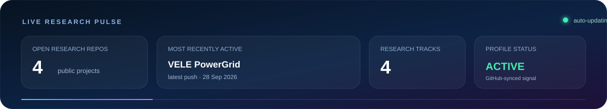

  

  
  
  
  

  <b>Assistant Professor · Ph.D. in Mathematics · Graph Theorist · Computational Researcher</b> 
  Building from mathematical graph structure to network and molecular systems to reliable scientific AI — with reproducibility, explicit limitations and auditability treated as part of the research record.

  

## ◉ Live research pulse

  

The pulse is regenerated from my public GitHub repositories by a scheduled GitHub Actions workflow. It is intended as a lightweight research-status signal, not a vanity counter.

---

## 🧭 Research compass

<table>
<tr>
<td width="50%" valign="top">
<b>λ Spectral & Structural Graph Theory</b> 
Graph matrices · graph energy · VELE · spectral bounds · extremal problems · inverse reconstruction
</td>
<td width="50%" valign="top">
<b>⌘ Network Science & Resilience</b> 
Failure-sensitive screening · power-grid networks · structural–physical validation · interpretable ranking
</td>
</tr>
<tr>
<td width="50%" valign="top">
<b>⬡ Molecular Graphs & QSPR/QSAR</b> 
Classical graph descriptors · representation degeneracy · EGFR modelling · chemical-space shift
</td>
<td width="50%" valign="top">
<b>◎ Reliable Scientific AI</b> 
Conformal prediction · scientific-rule gating · calibration · uncertainty · reproducible ML
</td>
</tr>
</table>

<code>Spectral graph invariants</code> · <code>VELE</code> · <code>Network resilience</code> · <code>QSPR/QSAR</code> · <code>Conformal prediction</code> · <code>Distribution shift</code> · <code>Knowledge-guided AI</code>

---

## 🔬 Featured open research

### ⚡ VELE Power-Grid Vulnerability Screening
**Graph theory × network resilience × power systems**  
Eccentricity-sensitive structural screening evaluated against island-aware DC-flow behaviour across **6 IEEE/MATPOWER systems**, **784 physical branch outages**, **558 single-bus outages**, and **1,692 progressive electrical states**.

`MATPOWER 8.1 cross-check` · `DC-flow validation` · `failure-mode transparency` · `frozen release`

---

### 🧬 EGFR Graph QSAR — Representation Limits
**Molecular graphs × QSAR × representation analysis**  
A matched study of **10,056 EGFR compounds** comparing **19 classical graph invariants**, RDKit2D and ECFP4, with exact descriptor-vector collision analysis showing where extreme topological compression loses chemical identity.

`Graph19` · `scaffold validation` · `representation degeneracy` · `chemical-space diagnostics`

---

### 🧠 Applicability-Gated Molecular AI
**Knowledge-guided AI × molecular prediction × applicability**  
A rule-residual framework that keeps an explicit scientific rule visible as a fallible expert and learns when that rule should be trusted, corrected or audited under chemical-space shift.

`AGRR` · `negative controls` · `rule-failure diagnosis` · `external B3DB transfer`

---

### 📐 Calibration Transfer of Conformal Prediction
**Uncertainty × distribution shift × scientific computing**  
Grouped conformal-prediction experiments across SCM composition regimes using **1,030 observations** and **427 physical mix designs**, with fixed seeds, sensitivity analyses and machine-readable numerical verification.

`conformal prediction` · `grouped validation` · `support diagnostics` · `reproducible uncertainty`

---

## 🧪 Open-research standard

| Reproducibility | Validation | Traceability | Scientific restraint |
|---|---|---|---|
| Executable workflows | Independent cross-checks | Data/source provenance | Negative findings retained |
| Pinned environments | Sensitivity analysis | Machine-readable outputs | Limitations stated explicitly |
| Frozen releases | Integrity checks | `CITATION.cff` / licensing | Claims kept within evidence |

> **Research principle:** build rigorous mathematics, test computational claims transparently, and make the evidence inspectable wherever possible.

---

<b>📚 Selected scholarly work</b>

 

### On Vertex Eccentricity Labeled Energy of a Graph
**Sunilgar Gusai, Vinodray Kaneria, Manoharsinh Jadeja**  
*International Journal of Basic and Applied Sciences*, **14**(4), 339–350, 2025  

My continuing VELE work studies structural properties, spectral behaviour, graph operations and network-oriented applications of eccentricity-driven graph-energy measures.

<b>🎓 Teaching & academic work</b>

 

I teach mathematical foundations for computing and data-oriented programmes, including:

`Linear Algebra` · `Calculus` · `Discrete Mathematics` · `Operations Research` · `Probability` · `Statistics` · `Applied Mathematics` · `Optimization`

I also contribute to academic coordination, curriculum work, examinations, student mentoring, research collaboration and institutional service.

<b>🤝 Collaboration directions</b>

 

I am open to serious academic collaboration in:

- spectral and extremal graph theory;
- graph energy and eccentricity-based invariants;
- network resilience and interpretable structural screening;
- molecular graph descriptors and QSPR/QSAR;
- reliable / uncertainty-aware scientific machine learning;
- reproducible computational research.

---

  
  
  

Rajkot, Gujarat, India · Mathematics → Networks → Molecular Systems → Reliable Scientific AI

