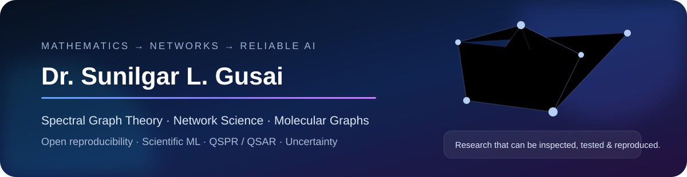

  

  
  
  
  

<h3 align="center">Assistant Professor · Ph.D. in Mathematics · Graph Theorist · Computational Researcher</h3>

Building from <b>mathematical graph structure</b> to <b>network and molecular systems</b> to <b>reliable scientific AI</b> — with reproducibility, explicit limitations and auditability treated as part of the research record.

---

<!-- RESEARCH-NOW:START -->
## ◉ Research now

> **4 public research projects** · **4 research tracks** · **Open reproducibility**

### Recently active
⚡ **[VELE Power-Grid Vulnerability Screening](https://github.com/SunilgarGusai/VELE-PowerGrid-Reproducibility)**  
Latest public push · **28 Sep 2026**

**Research arc**  
**λ Spectral Graph Theory** → **⌘ Network Resilience** → **⬡ Molecular Graphs & QSPR/QSAR** → **◎ Reliable Scientific AI**
<!-- RESEARCH-NOW:END -->

---

## 🧭 Research compass

<table>
<tr>
<td width="50%" valign="top">
<h3>λ Spectral & Structural Graph Theory</h3>
Graph matrices · graph energy · VELE · spectral bounds · extremal problems · inverse reconstruction
</td>
<td width="50%" valign="top">
<h3>⌘ Network Science & Resilience</h3>
Failure-sensitive screening · power-grid networks · structural–physical validation · interpretable ranking
</td>
</tr>
<tr>
<td width="50%" valign="top">
<h3>⬡ Molecular Graphs & QSPR/QSAR</h3>
Classical graph descriptors · representation degeneracy · EGFR modelling · chemical-space shift
</td>
<td width="50%" valign="top">
<h3>◎ Reliable Scientific AI</h3>
Conformal prediction · scientific-rule gating · calibration · uncertainty · reproducible ML
</td>
</tr>
</table>

<code>Spectral graph invariants</code> · <code>VELE</code> · <code>Network resilience</code> · <code>QSPR/QSAR</code> · <code>Conformal prediction</code> · <code>Distribution shift</code> · <code>Knowledge-guided AI</code>

---

## 🔬 Featured open research

<table>
<tr>
<td width="50%" valign="top">
<h3>⚡ VELE Power-Grid Vulnerability Screening</h3>
<b>Graph theory × network resilience × power systems</b>  
Eccentricity-sensitive structural screening tested against island-aware DC-flow behaviour.  
<b>6</b> IEEE/MATPOWER systems · <b>784</b> branch outages · <b>1,692</b> progressive states  
<a href="https://github.com/SunilgarGusai/VELE-PowerGrid-Reproducibility"><b>Explore repository →</b></a>
</td>
<td width="50%" valign="top">
<h3>🧬 EGFR Graph QSAR — Representation Limits</h3>
<b>Molecular graphs × QSAR × representation analysis</b>  
Matched benchmarking of classical graph invariants, RDKit2D and ECFP4 under chemical-space shift.  
<b>10,056</b> EGFR compounds · <b>19</b> graph invariants · exact collision analysis  
<a href="https://github.com/SunilgarGusai/EGFR-Graph-QSAR-Reproducibility"><b>Explore repository →</b></a>
</td>
</tr>
<tr>
<td width="50%" valign="top">
<h3>🧠 Applicability-Gated Molecular AI</h3>
<b>Knowledge-guided AI × molecular prediction × applicability</b>  
A rule-residual framework that learns when an explicit scientific rule should be trusted, corrected or audited.  
<b>AGRR</b> · negative controls · rule-failure diagnosis · external B3DB transfer  
<a href="https://github.com/SunilgarGusai/applicability-gated-molecular-ai"><b>Explore repository →</b></a>
</td>
<td width="50%" valign="top">
<h3>📐 Calibration Transfer of Conformal Prediction</h3>
<b>Uncertainty × distribution shift × scientific computing</b>  
Grouped conformal-prediction experiments across SCM composition regimes with fixed seeds and numerical verification.  
<b>1,030</b> observations · <b>427</b> physical mix designs · grouped validation  
<a href="https://github.com/SunilgarGusai/PAPER-JCMM-reproducibility"><b>Explore repository →</b></a>
</td>
</tr>
</table>

---

## 🧪 Open-research standard

| Reproducibility | Validation | Traceability | Scientific restraint |
|---|---|---|---|
| Executable workflows | Independent cross-checks | Data/source provenance | Negative findings retained |
| Pinned environments | Sensitivity analysis | Machine-readable outputs | Limitations stated explicitly |
| Frozen releases | Integrity checks | `CITATION.cff` / licensing | Claims kept within evidence |

> **Research principle:** build rigorous mathematics, test computational claims transparently, and make the evidence inspectable wherever possible.

---

<b>📚 Selected scholarly work</b>

 

### On Vertex Eccentricity Labeled Energy of a Graph
**Sunilgar Gusai, Vinodray Kaneria, Manoharsinh Jadeja**  
*International Journal of Basic and Applied Sciences*, **14**(4), 339–350, 2025  

My continuing VELE work studies structural properties, spectral behaviour, graph operations and network-oriented applications of eccentricity-driven graph-energy measures.

<b>🎓 Teaching & academic work</b>

 

I teach mathematical foundations for computing and data-oriented programmes, including:

`Linear Algebra` · `Calculus` · `Discrete Mathematics` · `Operations Research` · `Probability` · `Statistics` · `Applied Mathematics` · `Optimization`

I also contribute to academic coordination, curriculum work, examinations, student mentoring, research collaboration and institutional service.

<b>🤝 Collaboration directions</b>

 

I am open to serious academic collaboration in:

- spectral and extremal graph theory;
- graph energy and eccentricity-based invariants;
- network resilience and interpretable structural screening;
- molecular graph descriptors and QSPR/QSAR;
- reliable / uncertainty-aware scientific machine learning;
- reproducible computational research.

---

  
  
  

Rajkot, Gujarat, India · Mathematics → Networks → Molecular Systems → Reliable Scientific AI
