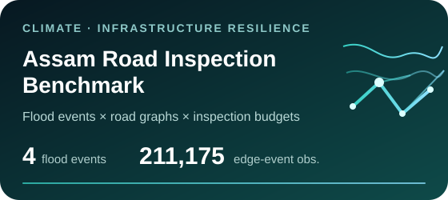
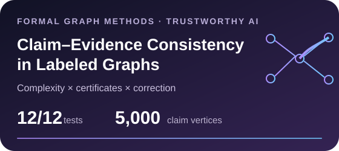
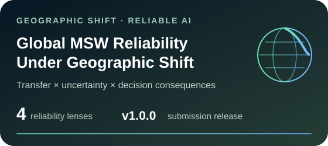
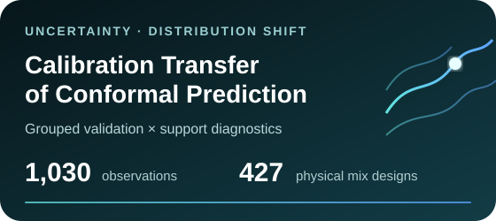

  

  
  
  
  
  

<!-- ACADEMIC_SYNC:PROFILE_ROLE:START -->

  <b>Assistant Professor of Mathematics · Program Head, Data Science Programs · Ph.D. · Graph Theorist · Computational Researcher</b>

<!-- ACADEMIC_SYNC:PROFILE_ROLE:END -->

  <b>Mathematical structure → networked systems → molecular & biomolecular graphs → reliable scientific evidence</b>

<!-- OBSERVATORY:START -->
## ◉ Current research signal

> **8 public research programmes** · **4 connected research directions** · **Open reproducibility**

### 🌍 [Global MSW Reliability Under Geographic Shift](https://github.com/SunilgarGusai/global-msw-reliability-under-shift)
**Most recently active public research project** · latest push **06 Oct 2026**

**Recent research trail**  
`06 Oct` **Global MSW Reliability** → `06 Oct` **VELE Power-Grid** → `06 Oct` **Claim–Evidence Consistency** → `06 Oct` **Applicability-Gated Molecular AI**
<!-- OBSERVATORY:END -->

---

## Research coordinates

<table>
<tr>
<td align="center" width="25%"><h3>λ Graph Theory & Formal Methods</h3><b>Spectral · structural · extremal · algorithms · certificates</b></td>
<td align="center" width="25%"><h3>⌘ Networked Systems & Resilience</h3><b>Power grids · road networks · failure impact · climate hazards</b></td>
<td align="center" width="25%"><h3>⬡ Molecular & Biomolecular Graphs</h3><b>QSAR · descriptors · residue networks · mutation geometry</b></td>
<td align="center" width="25%"><h3>◎ Reliable Scientific AI & Evidence</h3><b>Shift · uncertainty · calibration · evidence consistency</b></td>
</tr>
</table>

<b>MATHEMATICS → NETWORKS → MOLECULAR SYSTEMS → RELIABLE SCIENTIFIC EVIDENCE</b>

---

## Current frontier

<table>
<tr>
<td width="50%" valign="top" align="center">

 <b>Mutation-conditioned graph geometry for residue-network susceptibility</b>
</td>
<td width="50%" valign="top" align="center">

 <b>Leakage-controlled flood-road inspection under transfer and budget constraints</b>
</td>
</tr>
<tr>
<td width="50%" valign="top" align="center">

 <b>Complexity, verification certificates and correction in labeled evidence graphs</b>
</td>
<td width="50%" valign="top" align="center">

 <b>Geographic transfer, uncertainty and decision reliability in global waste-service prediction</b>
</td>
</tr>
</table>

## Established open research

<table>
<tr>
<td width="50%" valign="top" align="center">

 <b>Structural screening validated against physical network behaviour</b>
</td>
<td width="50%" valign="top" align="center">

 <b>Where classical molecular graph representations lose chemical identity</b>
</td>
</tr>
<tr>
<td width="50%" valign="top" align="center">

 <b>Learning when a scientific rule should be trusted, corrected or audited</b>
</td>
<td width="50%" valign="top" align="center">

 <b>Uncertainty calibration under composition and distribution shift</b>
</td>
</tr>
</table>

Every research cover opens the corresponding public reproducibility repository.

---

<!-- ACADEMIC_SYNC:PROFILE_PUBLICATIONS:START -->
## Published & accepted scholarship

### Edge Failure Sensitivity of Wiener and Harary Indices in Classical Network Graphs
**Sunilgar Gusai** · *International Journal of Scientific Development and Research*, **11**(9), b394–b402, September 2026  
  
`wiener index` · `harary index` · `edge failure`

### Explainable Machine Learning for Real-Time Cyber Threat Detection: An Intelligent Framework for Adaptive Information Security
*Computer and Decision Making (COMDEM)* · **Accepted for publication, 30 Sep 2026** · Manuscript **CDM_121**  
`explainable ml` · `cybersecurity` · `adaptive detection`

### Eccentricity-Based Bounds for the Spectral Radius of Graph Matrices
**Sunilgar L. Gusai** · *International Journal of Science and Research*, **15**, 681–686, 2026  
`spectral bounds` · `graph matrices`

### On Vertex Eccentricity Labeled Energy of a Graph
**Sunilgar Gusai, Vinodray Kaneria, Manoharsinh Jadeja** · *International Journal of Basic and Applied Sciences*, **14**(4), 339–350, 2025  
  
`vele` · `spectral graph theory` · `graph energy`
<!-- ACADEMIC_SYNC:PROFILE_PUBLICATIONS:END -->
---

## Research standard

<table>
<tr>
<td width="25%" align="center"><b>REPRODUCE</b> Executable workflows Pinned environments</td>
<td width="25%" align="center"><b>VALIDATE</b> Independent checks Sensitivity analysis</td>
<td width="25%" align="center"><b>TRACE</b> Data provenance Machine-readable outputs</td>
<td width="25%" align="center"><b>RESTRAIN</b> Negative findings retained Claims stay within evidence</td>
</tr>
</table>

> **Research principle:** rigorous mathematics, transparent computation, inspectable evidence, and explicit limitations.

---

<b>🎓 Teaching & academic work</b>

 

`Linear Algebra` · `Calculus` · `Discrete Mathematics` · `Operations Research` · `Probability` · `Statistics` · `Applied Mathematics` · `Optimization`

<!-- ACADEMIC_SYNC:PROFILE_TEACHING_ROLE:START -->
I serve as Program Head for Data Science Programs and Area Chair for Advanced Computing, alongside teaching, curriculum work, timetable coordination, examinations, student mentoring, research collaboration and institutional service.
<!-- ACADEMIC_SYNC:PROFILE_TEACHING_ROLE:END -->

<b>🤝 Collaboration directions</b>

 

I am open to serious academic collaboration in spectral and extremal graph theory, graph energy, formal graph methods, network resilience, molecular and biomolecular graph modelling, QSPR/QSAR, reliable scientific machine learning, uncertainty quantification, evidence verification and reproducible computational research.

---

  
  

<b>Rajkot, Gujarat, India</b> Mathematics → Networked Systems → Molecular & Biomolecular Graphs → Reliable Scientific Evidence

